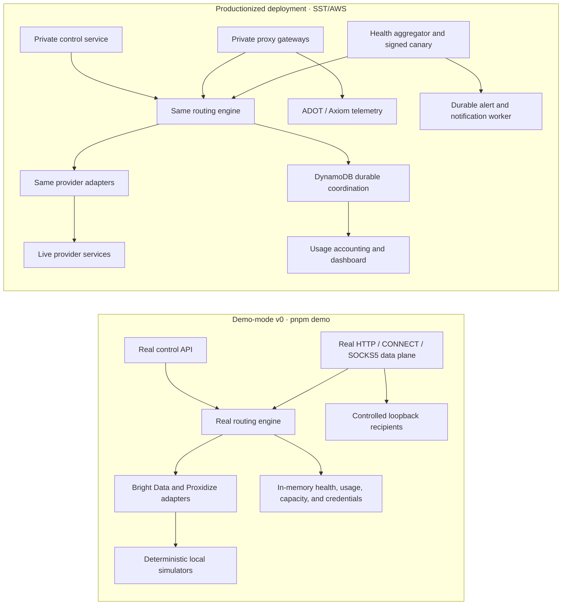

# Capability map: demo mode and production deployment

This guide separates two things that are easy to conflate:

- **Demo-mode v0** is the core proxy product exercised by `pnpm demo`. It runs the real control API, HTTP/HTTPS and SOCKS5 data planes, route service, provider adapters, routing algorithms, health-aware selection, credential lifecycle, and usage ledger. It substitutes deterministic provider simulators for paid vendors, keeps state in memory, disables telemetry export, and stops with no retained data.
- **Productionization** is the infrastructure and set of independently deployable services already implemented in this repository around that core. It adds live-provider credentials, shared durable state, distributed coordination, telemetry export, dashboards, accounting workers, synthetic verification, notifications, network isolation, scaling, release safety, and recovery controls.

`pnpm demo` proves the important request and routing behavior without requiring AWS or vendor accounts. It is not intended to simulate every operational service or prove that an installation's external AWS, Axiom, MaxMind, DNS, certificate, provider, and alert-destination configuration is correct.

## Same product logic, different operating envelope

The production deployment does not replace the demo's routing implementation. It runs the same v0 contracts and least-loaded routing behavior with production transports, persistence, evidence, and operational boundaries. Some productionization components also implement roadmap mechanisms ahead of their release-gate phase; those mechanisms remain separately classified and do not silently control v0 selection.

## Core requirements

### Request monitoring

| Requirement                | Demo-mode v0                                                                                                                                                                                                                                                        | Productionization already in the repository                                                                                                                                                                                                       |
| -------------------------- | ------------------------------------------------------------------------------------------------------------------------------------------------------------------------------------------------------------------------------------------------------------------- | ------------------------------------------------------------------------------------------------------------------------------------------------------------------------------------------------------------------------------------------------- |
| Track all proxy requests   | Every upstream attempt traverses the real data plane and is written to the in-memory usage ledger with operation, route, grant, customer, job, provider, protocol, outcome, latency, retry, byte, and pricing context. The walkthrough prints the sanitized events. | The same idempotent attempt records are stored durably in DynamoDB across tasks and deployments. Active tunnels are tracked and heartbeated so long-lived work and connection-seconds remain observable.                                          |
| Collect meaningful metrics | The walkthrough induces a pre-commit retry/failover and queries request, byte, average/p95 latency, retry, failover, and outcome metrics. Demo state is ephemeral and OTLP export is deliberately disabled.                                                         | Application services emit unsampled OTLP logs, traces, and metrics through task-local ADOT collectors to scoped Axiom datasets. High-cardinality routing evidence stays in restricted logs/traces and the usage ledger rather than metric labels. |
| Enable cost attribution    | The demo runs the accounting worker over real attempt events plus simulated provisioned-slot capacity. It visibly calculates Bright Data per-GiB cost and allocates Proxidize device-month cost by connection time.                                                 | The production worker runs continuously, records `Unallocated` capacity, and reconciles estimates with configured authoritative provider totals.                                                                                                  |
| Provide usage analytics    | The walkthrough starts the real in-memory dashboard/analytics service and queries `/api/usage` by customer, job, provider, and outcome after persisting hourly, daily, and per-customer rollups.                                                                    | The private production dashboard and `/api/usage`, `/api/usage/reconciliations`, `/api/usage/events`, and `/api/capacity` endpoints expose durable usage, cost, health, capacity, and policy evidence.                                            |

The practical boundary is: **the demo proves collection, aggregation, attribution, and querying with ephemeral data; production services make the same evidence durable and operationally continuous.**

### Provider management

| Requirement                                | Demo-mode v0                                                                                                                                                                                                                                                                                                                                          | Productionization already in the repository                                                                                                                                                                                                                                                            |
| ------------------------------------------ | ----------------------------------------------------------------------------------------------------------------------------------------------------------------------------------------------------------------------------------------------------------------------------------------------------------------------------------------------------- | ------------------------------------------------------------------------------------------------------------------------------------------------------------------------------------------------------------------------------------------------------------------------------------------------------ |
| Abstract provider-specific implementations | Route profiles and proxy credentials are provider-neutral. The real Bright Data and Proxidize adapters translate normalized geography, rotation, health, assignment, and authentication into provider-specific behavior, backed by local simulators.                                                                                                  | Live credentials and provider endpoints are injected from SST secrets. Provider details remain behind the same adapter contract and out of caller-facing APIs.                                                                                                                                         |
| Enable dynamic provider switching          | The routing engine evaluates compatible providers for each new connection. The walkthrough visibly routes residential and mobile profiles through different adapters without changing the client protocol.                                                                                                                                            | Live health, inventory, hard-capacity evidence, and current connection load affect eligibility and least-loaded ordering. Roadmap score components are retained as diagnostics only. A profile's explicit provider override remains the only caller-visible provider constraint.                       |
| Support load balancing                     | V0 orders eligible providers and individual Proxidize slots by active load with a stable identifier tie-breaker. It computes the versioned reliability, nonlinear-headroom, performance, cost-efficiency, and stability score only as a shadow roadmap diagnostic. Local slot claims prevent the demo from treating a device as infinitely available. | Slot load and candidate circuits are shared durably across gateway tasks. Atomic claims, liveness expiry, soft-capacity evidence, and Fargate scaling keep concurrent instances coordinated.                                                                                                           |
| Implement failover mechanisms              | Safe retry/failover is implemented in the real route service and simulators support failure injection. Failover occurs only before request or tunnel commitment and never falls back to the service's direct Internet connection. The default walkthrough demonstrates selection, rotation, and affinity rather than inducing every outage case.      | Durable provider/candidate circuits, normalized live-provider failures, shared health evidence, bounded attempt budgets, and cross-task state make the same pre-commit failover policy safe under distributed load. Deployed and live acceptance suites validate the production transports separately. |

### Health monitoring

| Requirement                   | Demo-mode v0                                                                                                                                                                      | Productionization already in the repository                                                                                                                                                                               |
| ----------------------------- | --------------------------------------------------------------------------------------------------------------------------------------------------------------------------------- | ------------------------------------------------------------------------------------------------------------------------------------------------------------------------------------------------------------------------- |
| Implement proxy health checks | `/health/ready` calls the real provider health contract; the demo verifies both simulated providers before sending traffic. Routing excludes unhealthy candidates.                | A dedicated health aggregator combines provider checks, passive proxy outcomes, capacity-pressure evidence, and optional signed end-to-end canary results into durable capability snapshots.                              |
| Provide alerting mechanisms   | Alert state machines and persistence contracts are part of the codebase, but `pnpm demo` does not start the aggregator or notification worker and therefore does not send alerts. | The aggregator creates durable alert/recovery episodes. The notification service signs, retries, deduplicates, and records webhook delivery; Axiom monitors can separately cover telemetry-pipeline and trend conditions. |
| Support automated failover    | The core router automatically retries or selects another healthy compatible candidate before commitment when the profile permits it.                                              | Production health, inventory, and capacity signals feed the same router; shared circuits prevent all tasks from repeatedly selecting a known-bad candidate.                                                               |
| Monitor performance metrics   | Establishment performance is recorded for metrics and the shadow roadmap score; it does not control v0 candidate ordering.                                                        | Unsampled per-attempt telemetry, durable usage records, Axiom datasets, capability history, and the dashboard expose latency, outcomes, throughput, connection time, utilization, and freshness.                          |

Health status and alerting are intentionally separate. A stale signal is visible as stale evidence; it does not automatically become an outage. The health aggregator owns capability classification, while the notification worker owns delivery.

## Advanced considerations

### Geographic optimization

| Requirement                                | Demo-mode v0                                                                                                                                                                                                                                | Productionization already in the repository                                                                                                                                                                                                                                                |
| ------------------------------------------ | ------------------------------------------------------------------------------------------------------------------------------------------------------------------------------------------------------------------------------------------- | ------------------------------------------------------------------------------------------------------------------------------------------------------------------------------------------------------------------------------------------------------------------------------------------ |
| Smart routing from geographic requirements | Profiles declare country, region, city, and carrier requirements. The demo exercises US residential selection and a New York/T-Mobile mobile route through the real compatibility logic.                                                    | The same hard constraints are evaluated against live provider capabilities and Proxidize inventory on every new selection, retry, failover, and failback.                                                                                                                                  |
| Provider selection from coverage           | Simulated provider inventories expose different countries, cities, carriers, and exact-city guarantees, allowing deterministic review of eligibility.                                                                                       | Versioned provider capability configuration, live inventory, provider health, and exact-city support levels determine coverage. The signed canary independently observes the resulting exit geography using a packaged MaxMind database.                                                   |
| Fallback for location constraints          | The router may use another provider or candidate only if it satisfies every supplied geographic level. It fails closed when no compatible healthy candidate exists; it never weakens a city or carrier requirement to improve availability. | Bounded exact-city verification, durable eligibility evidence, health/capacity circuits, and geography-aware diagnostics make fallback explainable across tasks. Location- or carrier-limited capacity recommendations are suppressed instead of recommending ineffective generic scaling. |

Geographic optimization therefore means **choosing the best eligible option**, not silently broadening the requested location.

### Resource optimization

| Requirement                                | Demo-mode v0                                                                                                                                                                                                                 | Productionization already in the repository                                                                                                                                                                                                                                                                                                                |
| ------------------------------------------ | ---------------------------------------------------------------------------------------------------------------------------------------------------------------------------------------------------------------------------- | ---------------------------------------------------------------------------------------------------------------------------------------------------------------------------------------------------------------------------------------------------------------------------------------------------------------------------------------------------------- |
| Dynamic scaling of mobile proxy allocation | The core engine shares available mobile slots, atomically counts active connections, orders by current load, and treats soft saturation as routing evidence. Shadow headroom evidence is reviewable without renting devices. | Durable slot inventory and active-load claims coordinate every data-plane task. The implemented roadmap capacity policy calculates recommended slot counts and estimated monthly cost impact. **Buying, assigning, or removing Proxidize slots remains an explicit operator action; the repository does not autonomously change the vendor subscription.** |
| Usage-based resource management            | V0 routing uses current connection load, health, and soft-capacity pressure. Observed throughput and prioritized-data forecasts feed shadow roadmap diagnostics and planning evidence rather than v0 selection.              | The accounting worker combines usage records with provisioned capacity to report current, peak, percentile, and time-weighted utilization; its implemented roadmap path emits idempotent capacity-pressure evidence and planning recommendations. ECS task count scales separately from paid mobile-slot inventory.                                        |
| Cost optimization strategies               | V0 selects the least-loaded eligible candidate deterministically and emits the versioned cost-aware roadmap score only as a shadow diagnostic. The local providers make that behavior deterministic and free to exercise.    | Historical provider prices, per-GiB estimates, device connection-seconds, reconciled totals, `Unallocated` capacity, capacity headroom, and recommendation cost deltas support diagnostics and procurement. Cost does not control v0 routing or bypass geography, safety, or health.                                                                       |

## What `pnpm demo` proves—and what it does not

| `pnpm demo` directly proves                                                                                                         | Requires a production-shaped stage or external integration                                  |
| ----------------------------------------------------------------------------------------------------------------------------------- | ------------------------------------------------------------------------------------------- |
| Native HTTP forwarding, HTTPS `CONNECT`, and authenticated SOCKS5 `CONNECT`                                                         | Private DNS, certificates, source-CIDR restrictions, and NLB/API Gateway behavior           |
| Provider-neutral profiles, grants, credentials, rotation, and revocation                                                            | SST secret ownership and live Bright Data/Proxidize authentication                          |
| Real adapter translation against deterministic provider simulators                                                                  | Actual provider coverage, exit quality, invoices, limits, and outage behavior               |
| Residential rotation, mobile affinity, geographic/carrier matching, shadow roadmap scoring, and health-aware least-loaded selection | DynamoDB durability, point-in-time recovery, multi-task coordination, and ECS replacement   |
| Per-attempt usage, latency, rollups, analytics queries, cost estimation, and sanitized output                                       | ADOT/Axiom export, retention, authoritative reconciliation feeds, and notification delivery |
| Fail-closed routing with no direct-Internet fallback                                                                                | Signed public-canary source observation and MaxMind data freshness                          |

Production readiness is therefore not inferred from a successful demo alone. Before shipping, run the offline test gates, live-provider smoke tests, black-box E2E suite, deployed AWS acceptance suite, and the [production readiness checklist](OPERATIONS.md#production-readiness-checklist).

## Where to go next

- Run the core walkthrough: [README](../README.md#run-the-offline-demo)
- Integrate a proxy client: [Consumer guide](USAGE.md)
- Deploy and operate the production services: [Operations guide](OPERATIONS.md)
- Understand configuration ownership: [Configuration audit](CONFIGURATION.md)
- Run local, live, and deployed verification: [Development guide](DEVELOPMENT.md#test-suites)
